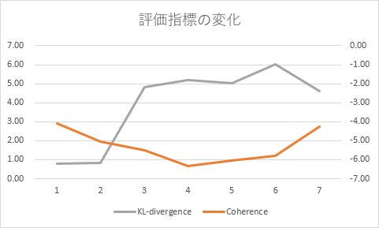

# トピックモデルによる短文の分類

by 佐田和也 (kazuya.sada@leadinge.co.jp)

---

<!-- header: 動機 -->

# 動機
- 短文で文書分類したい
- データセットを自分で用意したい

---

<!-- header: 方針 -->

# 方針

1. 何を分類するか
    - → Twitter のツイートを収集して使う
1. 教師ラベルをつけるのが大変
    - → 教師なし学習にする
1. 使えそうな分類モデル
    - → トピックモデル (LDA)
1. 使えそうなパッケージ
    - → gensim

---

<!-- header: 目標 -->

# 目標

1. gensim を使って
1. トピックモデル (LDA) で
1. 教師なし学習して
1. Twitter のツイートを分類する

## 興味

- ユーザごとのトピックの分布も調べてみたい

---

<!-- header: トピックモデル -->

# トピックモデル

- トピック (= 文書に潜んでいる主題) を推定する
- トピックごとに、単語の出現確率の分布が異なると仮定する
- ひとつの文書が複数のトピックを持つ

## LDA モデル
- トピックモデルのひとつ (潜在的ディリクレ配分法)
- ベイズ推定によって直接的な単語でなくても予測できる
    - 短文の分類に向いているのではないか

---

<!-- header: 懸念点 -->

# 懸念点

- モデルの評価の仕方が分からない
- 本当に分類できるのか
<br>
→ とにかくやってみよう

---

<!-- header: データセットの収集 -->

# データセットの収集
## Tweepy
- **Tweepy** : Twitter API を扱うためのパッケージ
### Twitter API を使って、検索結果 (JSON) を取得
- 検索キーワードを決める必要があった
    - q = 'です OR ます OR でした OR ました OR でしょう OR ましょう'
- 念のため、ユーザごとのタイムラインも保存

---

<!-- header: データセットの収集 -->

## MongoDB
- **PyMongo** : MongoDB にアクセスするためのパッケージ
- **NoQSLBooster for MongoDB** : GUI ツール

### Collections
- **tw_samples** : 検索で取得したツイート (112,284 件)
- **users** : 上記のツイートから抽出したユーザ情報 (96,895 件)
    - このうち 1,000 人くらいを、タイムライン取得の対象とする
- **usr_tweets** : ユーザのタイムラインから取得したツイート (2,043,636 件)

---

<!-- header: モデルの作成 -->

# モデルの作成
1. 訓練データを決める
    - ランダムに5万件を選んで、DB にフラグを追加
1. 形態素解析 (Janome)
    - DB の各ツイートに単語リストのフィールドを追加
1. 辞書と BoW 表現の作成 (gensim)
    - DB から単語リストを取得しつつ、gensim のメソッドに渡す (イテラブル)
    - 結果はファイルに保存
1. LDA モデルの作成 (gensim)
    - 結果はファイルに保存

---

<!-- header: モデルの作成 -->

**辞書**
```
419	あがる	24
812	あげる	298
3028	あした	25
...
```
**Corpus** (ツイートの BoW 表現)
```
[(12, 1), (31, 1), (32, 1), (33, 1), (34, 1), (35, 1), (36, 1)]
[(37, 1), (38, 1), (39, 1)]
[(71, 1), (72, 1)]
...
```

---

<!-- header: モデルの作成 -->

**Model** (辞書で展開したもの)
```
(0, '0.017*"フォロー" + 0.010*"プレゼント" + 0.009*"応募" + ...')
(1, '0.012*"質問" + 0.009*"箱" + 0.008*"見る" + 0.008*"peing" + ...')
(2, '0.009*"中" + 0.008*"者" + 0.007*"フォロー" + 0.007*"時間" + ...')
(3, '0.008*"頑張る" + 0.005*"お願い" + 0.005*"素敵" + 0.005*"できる" + ...')
(4, '0.015*"好き" + 0.009*"見る" + 0.009*"お願い" + 0.008*"できる" + ...')
(5, '0.021*"お願い" + 0.015*"交換" + 0.009*"求" + 0.009*"可能" + ...')
(6, '0.012*"お願い" + 0.008*"円" + 0.007*"大丈夫" + 0.006*"フォロー" + ...')
(7, '0.012*"中" + 0.009*"良い" + 0.009*"行く" + 0.008*"お願い" + ...')
```

---

<!-- header: チューニング -->

# チューニング
## 評価指標
- **Coherence** : モデルを表す単語に一貫性があるか
- **KL-divergence** : トピック間の距離

## 人による評価
- 実際に分類してみて人 (私) の脳で評価

---

<!-- header: チューニング -->

## パラメタ
- **num_topics** : トピックの数
- **alpha** : トピックの構成比がどうなっていると予測するか
    - 例 : すべてのトピックが同じ割合で出現
- **no_below** : 出現する文書が少ない単語をカット
- **no_above** : 出現する文書が多い単語をカット
- ストップワード（Corpus 作成時の実装で対応）

---

<!-- header: チューニング -->

## モデル 1号

### パラメタ
- **num_topics** : 8
- **alpha** : default (symmetric)
- **no_below** : 20
- **no_above** : 0.2

### 評価指標
- **Coherence** : -4.10
- **KL-divergence** : 0.80

特にトピックごとの特徴、トピック間の違いがわかりませんでした。

---

<!-- header: チューニング -->

## モデル 2号

### パラメタ
- 1号と同じ
- **ストップワードを追加**しました
    - 複数のトピックに高確率で出現する単語など

### 評価指標
- **Coherence** : -5.04 (-0.93)
- **KL-divergence** : 0.83 (+0.02)

特にトピックごとの特徴、トピック間の違いがわかりませんでした。

---

<!-- header: チューニング -->

## モデル 3号

### パラメタ
- **num_topics** : 8
- **alpha** : symmetric -> **auto**
- **no_below** : 20
- **no_above** : 0.2

### 評価指標
- **Coherence** : -5.49 (-0.45)
- **KL-divergence** : 4.82 (+3.99)

特にトピックごとの特徴、トピック間の違いがわかりませんでした。

---

<!-- header: チューニング -->

## モデル 4号

### パラメタ
- 3号と同じ
- 辞書を**名詞のみ**にしました

### 評価指標
- **Coherence** : -6.31 (-0.82)
- **KL-divergence** : 5.20 (+0.38)

特にトピックごとの特徴、トピック間の違いがわかりませんでした。

---

<!-- header: チューニング -->

## モデル 5号

### パラメタ
- 4号と同じ
- **重複するツイート** (RT) を取り除きました

### 評価指標
- **Coherence** : -6.06 (+0.25)
- **KL-divergence** : 5.01 (-0.19)

特にトピックごとの特徴、トピック間の違いがわかりませんでした。

---

<!-- header: チューニング -->

## モデル 6号

### パラメタ
- **num_topics** : 8
- **alpha** : auto
- **no_below** : 20 -> **100**
- **no_above** : 0.2 -> **0.1**

### 評価指標
- **Coherence** : -5.78 (+0.28)
- **KL-divergence** : 6.00 (+0.99)

特にトピックごとの特徴、トピック間の違いがわかりませんでした (6/22 AM 1:00)。

---

<!-- header: チューニング -->

## モデル 7号

### パラメタ
- **num_topics** : 8 -> **4**
- **alpha** : auto
- **no_below** : 100
- **no_above** : 0.1

### 評価指標
- **Coherence** : -4.27 (+1.51)
- **KL-divergence** : 4.61 (-1.39)

---

<!-- header: チューニング -->

ここまでの評価指標の変化



---

<!-- header: チューニング -->

## モデル 7号
### トピック 0/4

0.948	RT @stellaworth: ＼受付開始／ 6/26発売予定CD「天下統一恋の乱LoveBallad ...
0.931	RT @CabbitOfficial: Cabbit最新作「鍵を隠したカゴのトリ」がついに来週の ...
0.930	RT @saikoro1to3: 【バトルスピリッツ予約受付】 8月31日発売予定 バトル ...
0.928	RT @side_connection: 『恋姫†礼舞 KOIHIME LIVE2019』 開催日：2019年11月 ...
0.927	RT @comic_cune: 「あやかしこ」コミックス最新第６巻は５月２３日(木)発売 ...
0.924	RT @oxgakuox: 東海テレビ #スイッチ ご覧いただきありがとうございました ...
0.923	RT @i_luvJ: 最後の挨拶です〜  東京のみなさま どうぞいらっしゃいました ...
0.923	RT @aikoh_nico: 【お知らせ】 今週のニコ生"野良犬の穴"はお休みとなります ...
0.922	RT @animateonline: 📢Windows用🔞ゲーム 2019年6月28日(金)発売 『Fate ...
0.919	RT @pre_dia: 【明日！】 6/1(土)「GIG TAKAHASHI tour 2019」＠新横浜 ...

---

<!-- header: チューニング -->

## モデル 7号
### トピック 1/4

0.949	RT @irukanigohan: 最近、デマな鯨食論があり、「鯨肉がごく一部の地域の ...
0.947	RT @yuya_1243: 彼女にベタ惚れな彼氏 彼氏にベタ惚れな彼女  彼女の笑顔の ...
0.947	RT @onnnanolove: 彼女にベタ惚れな彼氏 彼氏にベタ惚れな彼女  彼女の笑顔の ...
0.944	@homurashouken おっしゃる通りです！  レアアース然り米国債(貿易赤字) ...
0.940	RT @1415920: 新しい環境で働き初めて二週間くらい経ったんだけど、歳が ...
0.939	RT @kawagoemizusaki: 猫カフェ×ネカフェ「猫家 川越店」が天国すぎる！...
0.937	RT @amasehimika147: 合成洗剤を使わないことは、もちろん聖三活動の柱の ...
0.934	RT @tyan_sae: 「若い人が昔の作品を好んで語りたがるのが無理してるのか ...
0.934	@new238528591 @KentoSymi 私は眞島さんと同年ですがかなり若くても全然 ...
0.932	マルバスちゃん可愛い。※メギド72の話 元々ぶりっ子な子はあまり好きでは ...

---

<!-- header: チューニング -->

## モデル 7号
### トピック 2/4

