# Tuning history

## model_01
be6c9e6e852144f53271d1c68c11468e5250512d

### 条件

|項目|値|
|-|-|
|品詞|'名詞', '動詞', '形容詞', '形容動詞'|
|ノイズ除去|RT, URL, mention|
|stop_words|(See stop_words.py)|
|訓練データ数|50,000|
|no_below|20|
|no_above|0.2|
|num_topics|8|
|alpha|default (symmetric)|

### 結果

Coherence: -4.103670646845522  
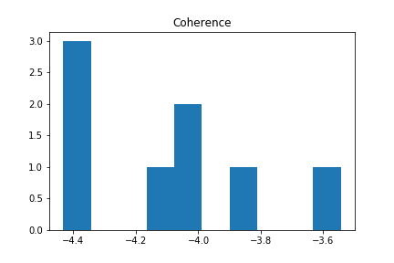

KL-divergence: 0.808693450476442  
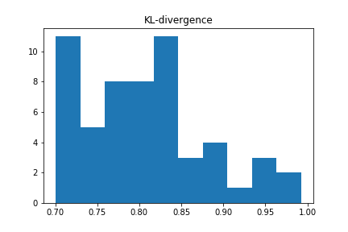

---
## model_02
25fe30fc69c8869c14bcc4f874232e09f51760dd

### 条件

|項目|値|
|-|-|
|品詞|'名詞', '動詞', '形容詞', '形容動詞'|
|ノイズ除去|RT, URL, mention|
|stop_words|**追加した** (See stop_words.py)|
|訓練データ数|50,000|
|no_below|20|
|no_above|0.2|
|num_topics|8|
|alpha|default (symmetric)|

### 結果
Coherence: -5.036905587315074  
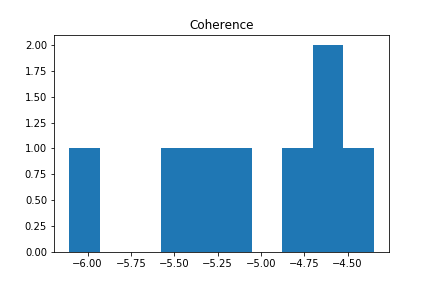

KL-divergence: 0.8286949076822826  
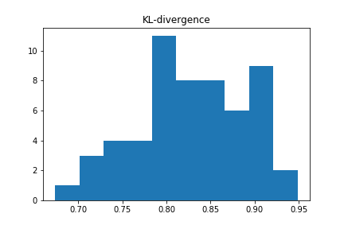

---
## model_03
2fbeb09304bb02f3d46ba7d37046f4fa5dd8d827

### 条件

|項目|値|
|-|-|
|品詞|'名詞', '動詞', '形容詞', '形容動詞'|
|ノイズ除去|RT, URL, mention|
|stop_words|(See stop_words.py)|
|訓練データ数|50,000|
|no_below|20|
|no_above|0.2|
|num_topics|8|
|alpha|**auto**|

### 結果
Coherence: -5.491802105728876  
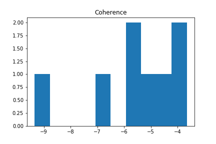

KL-divergence: 4.820552068097251  
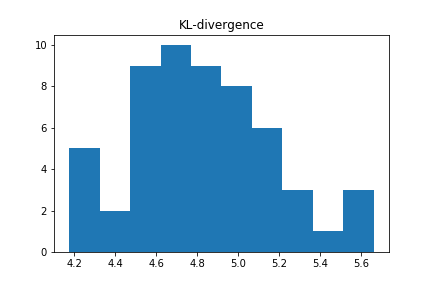

---
## model_04
d7a69c10136e54ab0bf30ccbac49f06c0a0e987b

### 条件

|項目|値|
|-|-|
|品詞|**'名詞' ('代名詞' 以外)**|
|ノイズ除去|RT, URL, mention|
|stop_words|(See stop_words.py)|
|訓練データ数|50,000|
|no_below|20|
|no_above|0.2|
|num_topics|8|
|alpha|auto|

### 結果
Coherence: -6.314667011288767  
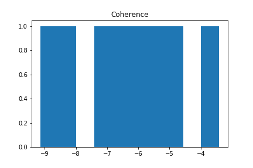

KL-divergence: 5.202539435454777  
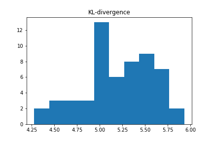

---
## model_05
786a4ce23d636992d2495ef00c280d70130fd241

### 条件

* サンプルツイートから重複を取り除いた。
* それ以外は model_04 と同じ。

### 結果
Coherence: -6.062594342322906  
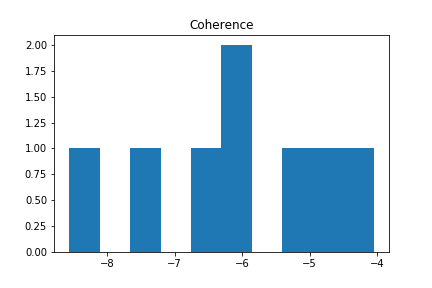

KL-divergence: 5.008528300694057  
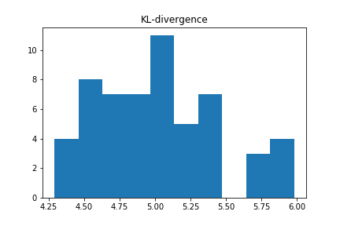

---
## model_06

### 条件

|項目|値|
|-|-|
|品詞|'名詞' ('代名詞' 以外)|
|ノイズ除去|RT, URL, mention|
|stop_words|(See stop_words.py)|
|訓練データ数|50,000|
|no_below|100|
|no_above|0.1|
|num_topics|8|
|alpha|auto|

### 結果
Coherence: -5.784420267443469  
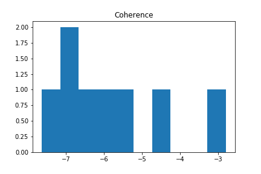

KL-divergence: 6.001177881445203  
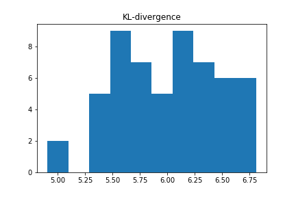
